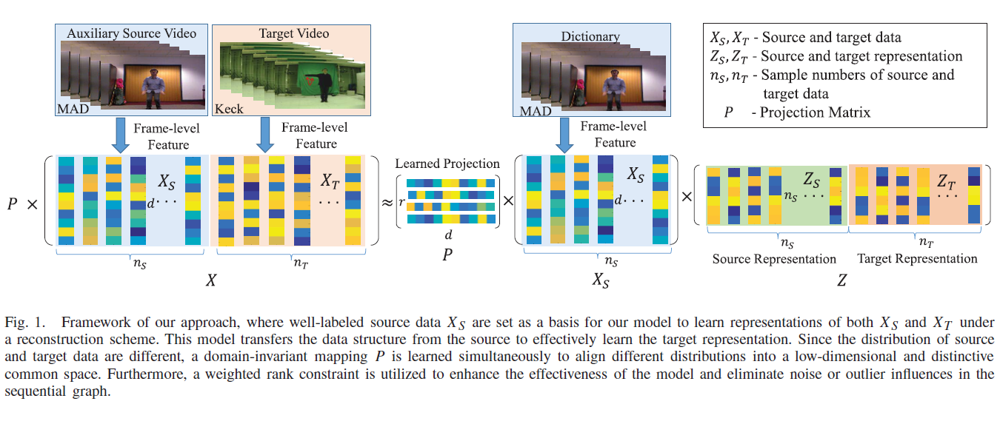

# LTS Action Segmentation
This repository contains code for our TIP (Transactions on Image Processing) paper: [Low-Rank Transfer Human Motion Segmentation](https://github.com/wanglichenxj/LTS_Action_Segmentation/blob/master/Presentation/LTS_Action_Segmentation_TIP18_Lichen.pdf) (LTS). LTS is a journal extension on our previous work: [Learning Transferable Subspace for Human Motion Segmentation](https://github.com/wanglichenxj/TSS_Action_Segmentation). LTS proposed a novel low-rank constraint associate with the temporal constraint for human action segmentation in time space. Experimental results demonstrates the effectiveness and high performance of the proposed model.

<div align="center">
    
</div>

Human motion segmentation has great potential in real world applications. Conventional segmentation approaches cluster data with no guidance from prior knowledge, which could easily cause unpredictable segmentation output and decrease the performance. To this end, we seek to improve the human-motion segmentation performance by fully utilizing pre-existing well-labeled source data. Specifically, we design a new transfer subspace clustering method for motion segmentation with a weighted rank constraint. Specifically, our proposed model obtains representations of both source and target sequences by mitigating their distribution divergence, which allows for more effective knowledge transfer to the target. To guide new representation learning, we designed a novel sequential graph to preserve temporal information residing in both the source and target. Furthermore, a weighted low-rank constraint is added to enforce the graph regularizer and uncover clustering structures within data. Experiments are evaluated on four human motion databases, which prove the enhanced performance and increased stability of our model compared to state-of-the-art baselines.

## Running the code
The code is MATLAB code works in Ubuntu system. Windows system may need minor revision in the folder name. Direct diwnload the code and run LTS_demo.m.

This repository contains two datasets, Weizmann dataset and Keck dataset, which are extracted HOG feature frame by frame. The features are 324-dimension feature metrix.

## Authors
Welcome to send us Emails if you have any questions about the code and our work :-)
* **Lichen Wang** [Website](https://sites.google.com/site/lichenwang123/)
* **Zhengming Ding** [Website](http://allanding.net/)
* **Yun Raymond Fu** [Website](http://www1.ece.neu.edu/~yunfu/)

## Citation
This code is corresponding to our TIP 2019 paper below:
```
@ARTICLE{Seg_Lichen_TIP18, 
  author={Lichen Wang and Zhengming Ding and Yun Fu}, 
  journal={IEEE Transactions on Image Processing}, 
  title={Low-Rank Transfer Human Motion Segmentation}, 
  year={2019}, 
  volume={28}, 
  number={2}, 
  pages={1023-1034},
  doi={10.1109/TIP.2018.2870945},
}
```
This work is our AAAI 2018 extension work: [Learning Transferable Subspace for Human Motion Segmentation](https://github.com/wanglichenxj/TSS_Action_Segmentation). A low-rank constraint is designed to further reconstruct the temporal data structure and improve the performance.
```
@inproceedings{TSS_Lichen_AAAI18,
  author = {Lichen Wang and Zhengming Ding and Yun Fu},
  title = {Learning Transferable Subspace for Human Motion Segmentation},
  conference = {AAAI Conference on Artificial Intelligence},
  year = {2018},
}
```
Please cite our paper if you like or use our work for your research, thank you very much!
